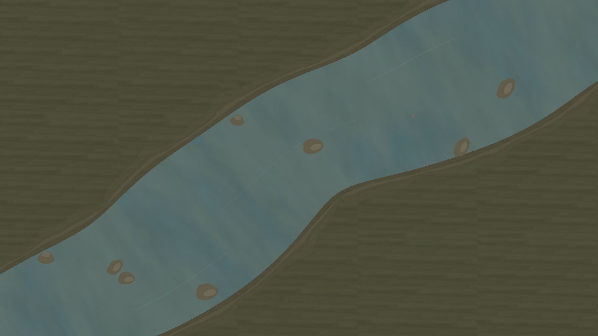

# cast

Status: in progress. A fly fishing game in Lua on LOVE 11.5. The river sim runs. Fishing itself is not in yet.

Repo: https://github.com/bxrne/cast



## Getting started

Needs LOVE 11.5.

```sh
cd /Users/bxrne/Projects/cast
love .
```

Keys:

- F1 toggles the debug panel. Seeds change only from the panel.
- Arrow keys adjust the selected row.
- Esc quits. F12 saves `current.png` to the LOVE write dir.

## How it works

Seeded river. Bed type, size, meander, and flow all derive from the seed. Trout spawn on ranked habitat lies and run behaviour trees: flee, bully, rise, seek, feed.

Habitat scoring follows PHABSIM practice. Velocity, depth, and cover each map to a 0..1 suitability index. The three combine as a geometric mean HSI. Lie choice then weights that HSI by net energy gain.

Energy follows Hughes and Dill drift feeding logic. Intake scales with drift speed in the next lane times capture success. Cost scales with hold speed cubed. Slack water next to a fast seam wins.

## Task list

Done:

- Seeded river with typed beds (chalk, peat, gravel, silt, bedrock).
- Live flow field: bends, thalweg, riffle pool depth, bank drag, eddy clusters, rock wakes.
- Water shader rides the flow map (heading plus relative speed).
- Rocks with shade. Fish keep clear of stone via occupancy plus push out.
- Trout behaviour trees with feed phases, column depth, spook, bully, rises.
- Species fit the water. Bed, flow, and size set the mix. Each fish gets a tuned copy (skittish, cruise, surface period, aggression, rise depth).
- Realistic swim. Segmented bodies with tail fins. Brown trout blend swim and slither. Beat follows activity (rest, hold, cruise, chase, burst, rise).
- Breach spray plus rare film dimples. No wake paint while swimming.
- Soft banks that feather into the ground. Wet lip under the water edge.
- Debug panel with seed, pause, time scale, current, turbulence, bed exposure, water sheen, flow arrows, fish tags, bed label.
- Foam removed entirely. No foam code, knobs, or refs remain.

Planned, in order:

1. Fishing and casting. Line, leader, fly, drift, take detection.
2. Equipment. Rod, line, and fly choice that change presentation.
3. Scoring. Fish logged by species, size, and water. Beat records per seed.
4. Fish body shader with top versus belly colour and behaviour linked flash.
5. Math reference equations in comments across modules.
6. Final refactor pass on layout and module bounds.

## Layout

- `draw/`: river scene, flow field, rocks, splash pool, water shader.
- `entity/`: trout, species, habitat scoring, mind, behaviour trees.
- `lib/`: math and gfx helpers.
- `ui/`: debug panel.
- `main.lua`, `conf.lua`: boot, loop, panel wiring.
- `current.png`: latest river shot (chalk beat, seed 8).
